# PathPocket: a first project, step by step

This guide is for a researcher opening PathPocket for the first time. Start with the replay if you do not have a suitable NVIDIA GPU. You can learn the interface before running any calculation. This is a local release candidate; public download addresses, author information and license are awaiting approval.

## 1. What you will do

PathPocket compares local regions across protein structures. A **state** is a group of input conformations; a **region family** connects corresponding local positions; a **target** is a saved receptor and center passed to pretrained ED2Mol. Generated candidates are organized into chemical space and can be viewed in their original spatial context.

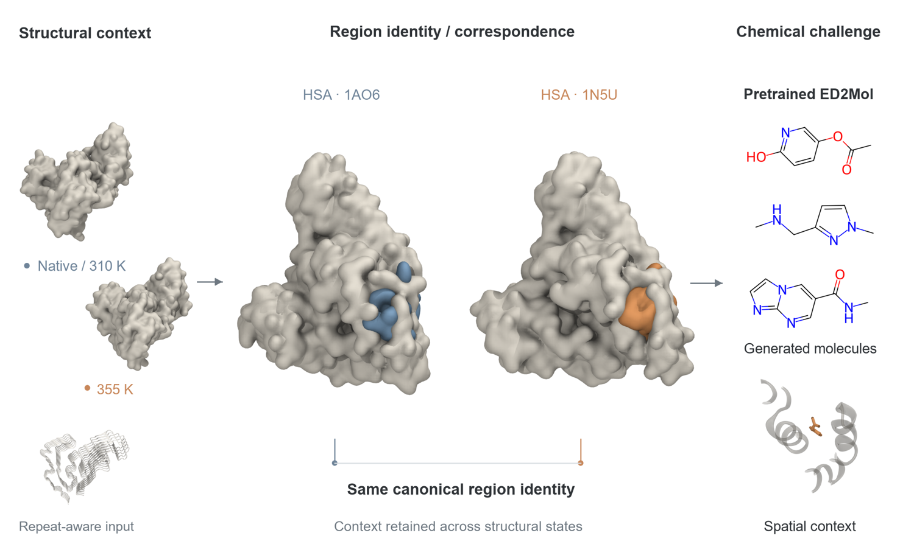

Follow the sequence: import structures → compare local regions → select targets → generate candidates → inspect chemical space → locate a molecule → export its coordinates. A candidate region is a starting point for investigation; generated molecules require subsequent experimental assessment.

## 2. Install and open

**Windows 11.** Obtain the approved Windows GPU EasyDeploy package from the project maintainer. Extract the entire ZIP to a writable folder. Double-click `Setup_First_Run.bat`. Allow the documented administrator step when Windows needs to enable WSL2. If it requests a restart, restart and run the same setup again. The installer obtains the scientific runtime and pinned third-party downloads. Keep the computer online until verification finishes. Thereafter, double-click `PathPocket_GUI.exe`. The source ZIP is not an EasyDeploy binary installer.

**Native Ubuntu.** Extract the approved Linux portable archive. In that folder, run `bash Setup_First_Run.sh`; subsequent launches use `bash PathPocket.sh`. The scientific application uses the package's private runtime. System Conda/Python is not the scientific runtime. Install a compatible NVIDIA driver first. See [Linux installation](INSTALL_LINUX_EN.md) and [Windows installation](INSTALL_WINDOWS_EN.md).

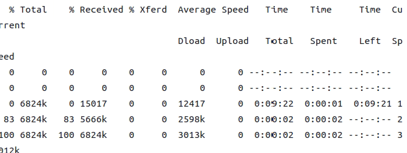
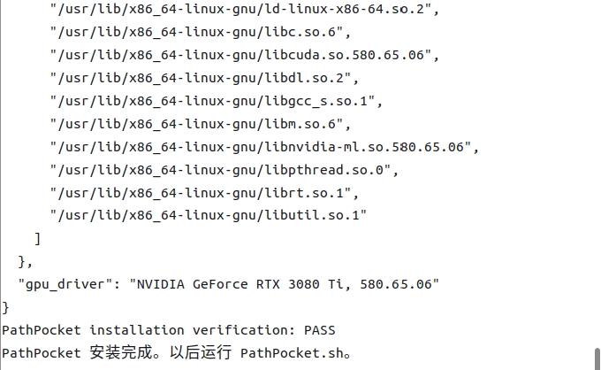
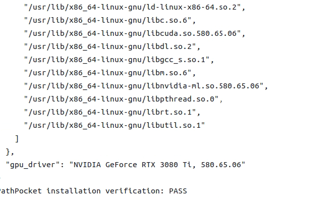

**Expected result:** the installation verifier reports PASS and the GUI opens. These three images are actual native Linux evidence. On Windows the setup window differs. If setup requests restart or reports a missing download, keep the log and retry the same setup; do not change scientific configuration to work around a hardware error. A doctor failure must be resolved before new generation; replay remains available without GPU generation.

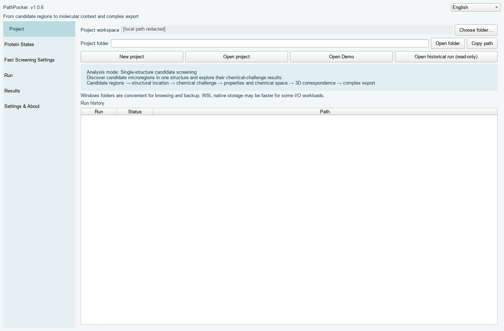

## 3. Create the first project

### Step 1 — Choose a workspace and name

Click **New project**. Choose the analysis mode for your structure: single structure, multiple conformations, or repeat/aggregate as appropriate. Enter a short project name, such as `My_HSA_Project`, and select an empty, writable workspace. The preview shows where the project will be stored under `20_PROJECTS`. Keep it outside the application directory so updates do not affect your results.

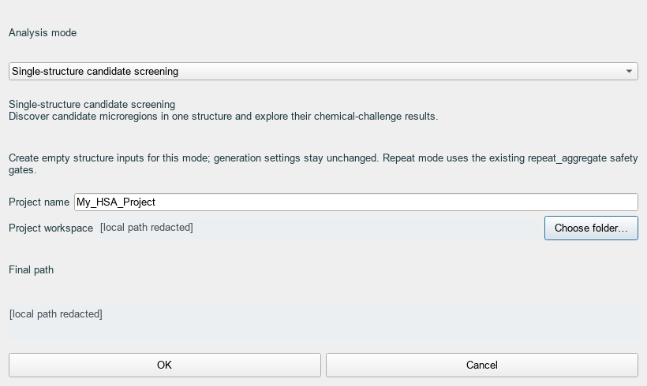

**Expected result:** a new project folder and project configuration. If the name already exists, use a different name to preserve the previous project. Gray boxes in these tutorial images hide local paths; they are not application errors.

### Step 2 — Import protein structures

Open **Protein States**, click **Add PDB**, choose the state and select the PDB/CIF file. Group only structures that represent the intended state. Use ordinary public HSA structures for practice. For the prepared HSA minimal example, open its supplied project instead of selecting a new pocket yourself.

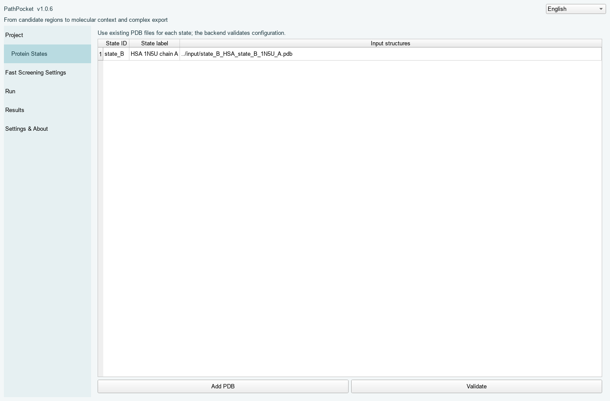

**Expected result:** the table lists the state ID and structure path. Click **Validate**. Ambiguous or low-confidence identity mapping should stop for review rather than silently pairing residues. Do not repair that warning by guessing residue correspondences.

### Step 3 — Set the small Fast Screening budget

Open **Fast Screening Settings**. For the supplied minimal example use **10 molecules**, **seed 42**, **iteration 2**. It contains one frozen HSA family and one target. Save and validate. The advanced YAML box is shown for transparency; ordinary use does not require typing Python or Conda commands.

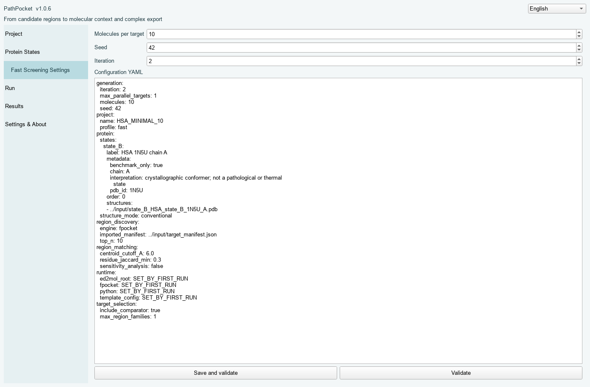

### Step 4 — Check readiness, then run

Open **Run**, click **Backend doctor**, and wait for a successful readiness check. Click **Run** after validation succeeds. Follow the named stages rather than treating the number of written molecules as a live completion percentage. This packaging task did not launch a new calculation; the screenshot below shows the controls before execution.

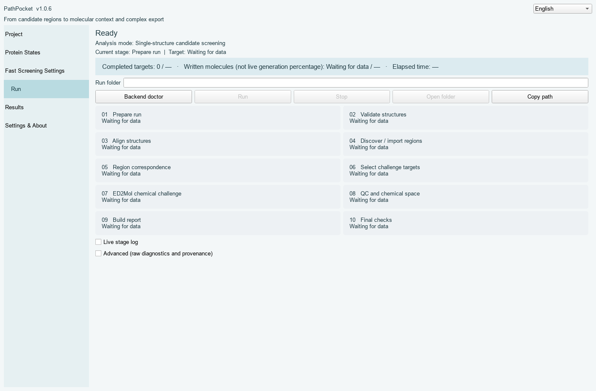

**Expected result:** COMPLETE with a saved run folder and result tables. If GPU support is unavailable, stop and fix the driver/runtime; do not substitute an unrecorded CPU run. Keep logs for failed attempts.

## 4. Read the results

The following screenshots show the **archived 20-molecule HSA replay**, not a fresh 10-molecule result.

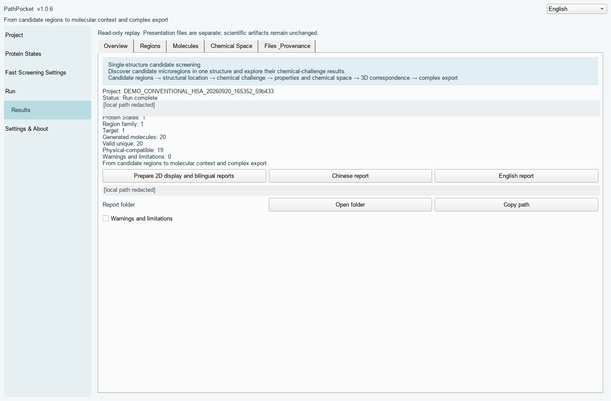

**Regions** connects target IDs to the input state and corresponding local region. Occurrence describes representation among supplied conformations; it is not a probability of disease association.

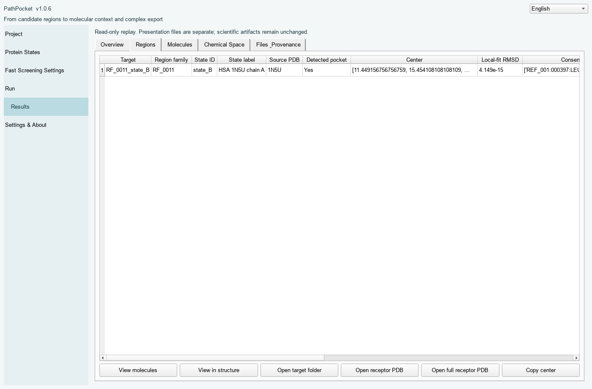

**Molecules** lists generated records, descriptors and QC flags. Select a molecule before opening its structure. A clash flag means a geometric screen failed; it is useful information, not a rendering error. The identifier is meaningful only together with its target and run.

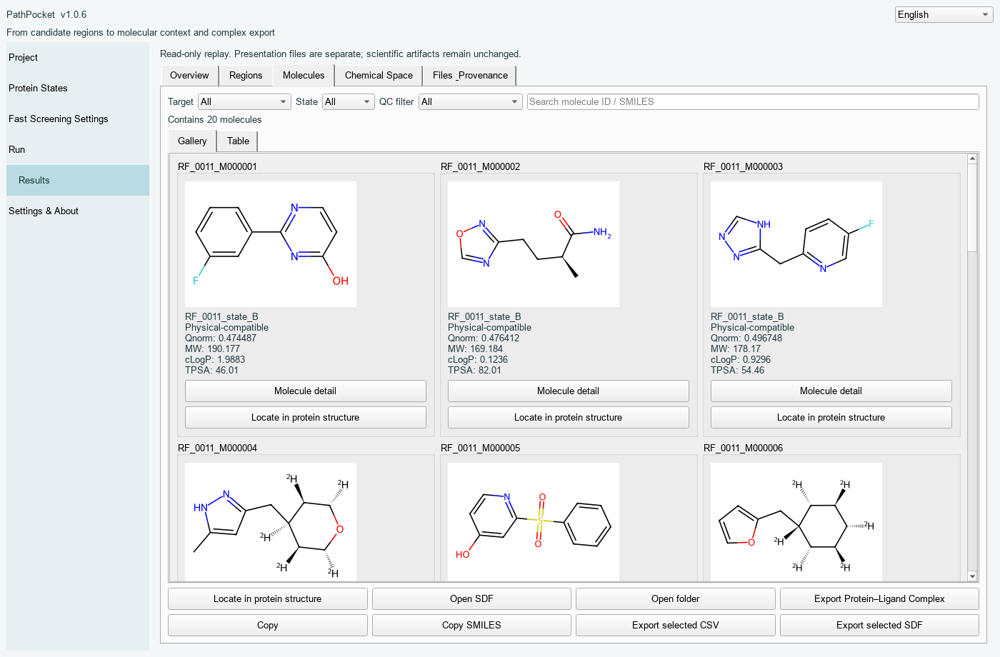

**Chemical Space** compares the stored candidates. Select the target first; switch between PCA and property plots. PCA positions summarize fingerprint variation, not binding affinity. **View molecules** follows the current target selection; **Source CSV** exposes the plotted data.

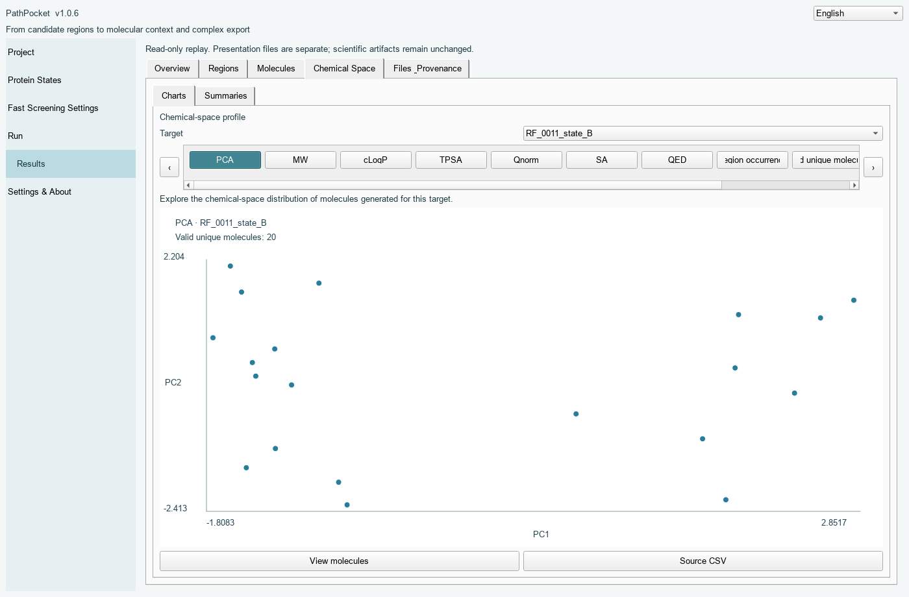

**Structure Location** opens a separate view for the selected molecule. Drag to rotate, scroll to zoom, and use **Focus region** to inspect the stored target neighborhood. **Export Protein–Ligand Complex** writes a receptor–ligand PDB, ligand SDF and provenance JSON to a new export folder. It preserves stored coordinates; it does not dock or minimize the molecule.

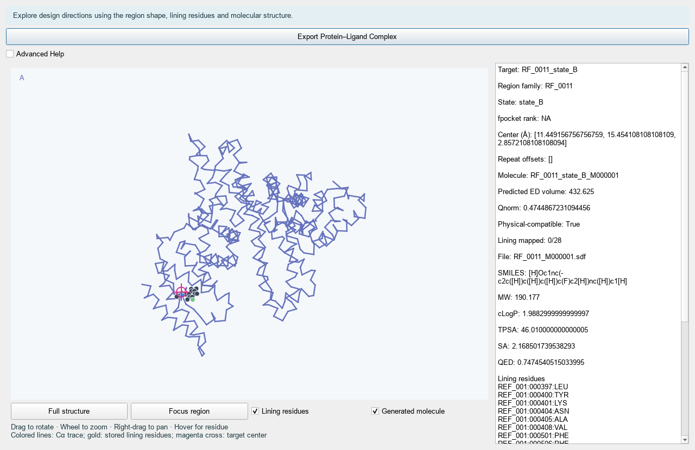

**Expected result:** molecule, target and state IDs agree between the gallery and structure view. Open `info.json` beside an exported complex to see the original SDF record and hashes. A missing lining-residue highlight is reported by the viewer; do not interpret it as absence of the region.

## 5. HSA minimal working example — new generation with GPU

Use `examples/HSA_MINIMAL_10` in the code snapshot, or the separate `03_MINIMAL_WORKING_EXAMPLE`. Read its bilingual README, prepare it inside a new workspace, and open the prepared `project.yml` with the installed GUI. The prepared manifest contains **RF_0011 / RF_0011_state_B**, from HSA 1N5U chain A. Request 10 molecules, seed 42, iteration 2. This is a small prepared-target pipeline check; it does not repeat the three-structure discovery benchmark. Check the expected contract rather than expecting identical molecular bytes on a different GPU.

## 6. Replay — no generation GPU needed

Use the separate `04_REPLAY_DEMO` package. In the installed GUI choose **Open historical run (read-only)** and select `20_PROJECTS/HSA_REPLAY/runs/RUN_20260920_165815`. Alternatively, after installing the source-viewer dependencies, run the repository's `scripts/replay.py` with that run directory. The source launcher disables backend calls. The replay has 20 valid unique molecules and 19 clash-compatible records.

Open Results → Molecules → select `RF_0011_state_B_M000001` → Structure Location. Switch to Chemical Space and choose `RF_0011_state_B`. Export a complex to a new folder outside the replay run. **Expected result:** interactive plots and coordinates, without ED2Mol startup. Keep the original run read-only; exports belong in your own working folder.

## 7. When the result is NO_TARGETS

NO_TARGETS means that the selected-target set is empty. The run can be COMPLETE, with target count zero, zero ED2Mol invocations, and generation SKIPPED. The bundled NO_TARGETS example is a trusted engineering fixture that exercises this path from the existing GUI entry; it is not evidence that the input protein contains no pockets. Ordinary projects that naturally select no targets also end safely without enabling the engineering fixture.

## 8. Find the output you need

| File or folder | What it is for |
|---|---|
| `run_manifest.json` | Run status, configuration and provenance |
| `03_REGION_DISCOVERY` / `04_REGION_MATCHING` | Detected instances and correspondence families |
| `05_TARGET_SELECTION/targets.json` | Selected targets, centers and receptor context |
| `06_CHEMICAL_CHALLENGE/<target>/raw/output.sdf` | Original generated molecular records |
| `molecule_qc.csv` / `07_ANALYSIS` | QC, descriptors, identities, clusters and embedding data |
| `08_REPORT/summary.json` | Machine-readable summary used by the GUI |
| exported `complex.pdb` | Original receptor plus selected ligand coordinates |
| exported `ligand.sdf` | Selected molecular record |
| exported `info.json` | Source IDs, hashes and coordinate-export provenance |

## 9. Questions that often come up

| Question | Answer |
|---|---|
| Why is no region selected? | First inspect validation and correspondence, then the recorded selection criteria. An empty selection is allowed. |
| Why are some molecules clash-flagged? | The stored heavy-atom geometric QC detected receptor or internal overlap. View the flagged geometry alongside the descriptors. |
| What is Qnorm? Is it affinity? | It is the model-density score normalized by heavy-atom count and the density-grid maximum: Qraw/(Nheavy × rho_max). It is not an affinity estimate and is not calibrated for ranking unrelated targets. |
| Why can fpocket volume vary? | Its volume estimate includes stochastic sampling. Region matching uses centroid and lining-residue agreement; volume is a secondary descriptor. |
| Does PathPocket dock molecules? | No docking stage is part of this fast workflow. |
| Does export minimize coordinates? | No. It preserves the selected stored coordinates. |
| Can I use CPU only? Why NVIDIA? | CPU-only browsing and export of a replay are supported. New pretrained generation requires the tested CUDA/NVIDIA runtime; there is no silent CPU fallback. |
| Can I use my own PDB? | Yes. Validate identities and state grouping before running; keep the original file and mapping provenance. |
| Can I use amyloid/repeat structures? | Use the repeat/aggregate mode and inspect the saved repeat mapping and local unit. The real 7KWZ example illustrates this case. |

## Source-viewer installation for technical users

In a new Python environment, install the code snapshot with `python -m pip install .` and the viewer dependencies with `python -m pip install -r requirements-viewer.txt`. Run `python scripts/replay.py <replay-run-directory>`. This source installation is distinct from the novice portable installer and does not download weights. See the installation guides for the generation runtime and third-party locks.
